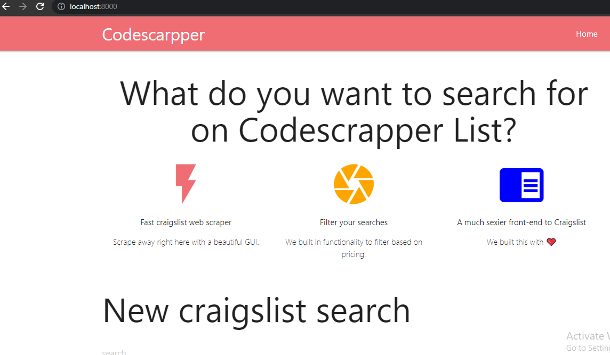

<!-- PROJECT LOGO -->
 

  

  <h3 align="center">Django-webscarpping-application</h3>

  

    An awesome webscapper using django with a good front end
     
    <a href="https://github.com/Gahdloot/Django-webscarpping-application"><strong>Explore the docs »</strong></a>
     
     
    <a href="#">View Demo(unavailable)</a>
    ·
    

<!-- TABLE OF CONTENTS -->

<!-- ABOUT THE PROJECT -->
## About The Project

This is just a basic frontend project with a strong django backend that also uses the power of beautifulsoup4 and requests for webscrapping  

Here is a summary of how the project was built:
* Using the Materialize to build a good UI for the front-end
* Using Django and sqlite to get search inputs and save them to the Database
* Using beautiful soup and request to scrap from crags-list the inputted search

Note, this project requires a vpn to work, because it is only accessible for people in los-angeles
